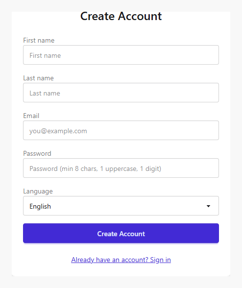
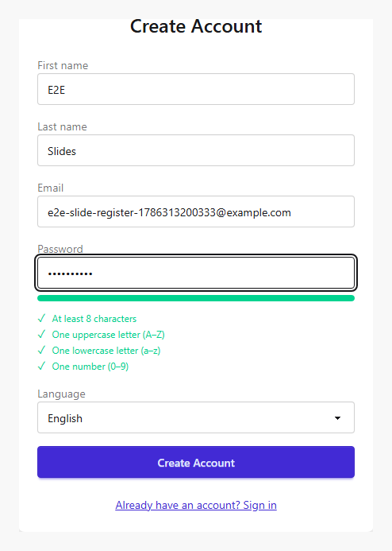
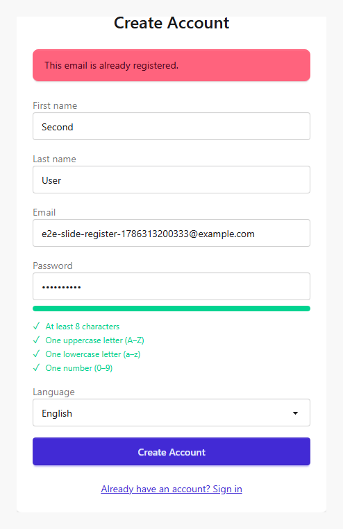
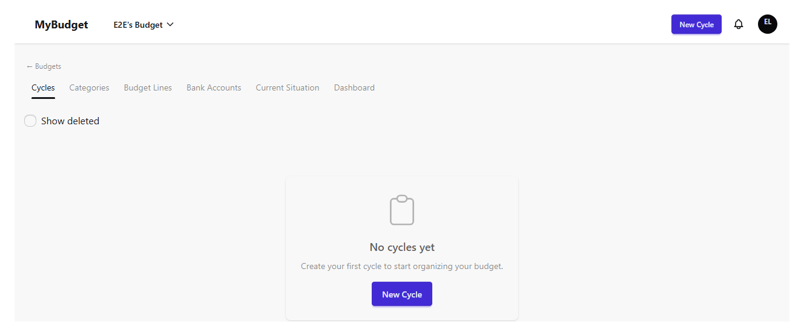
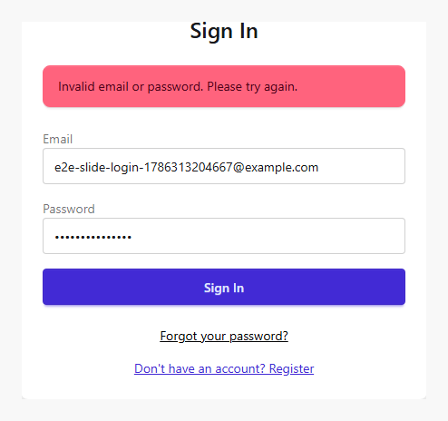
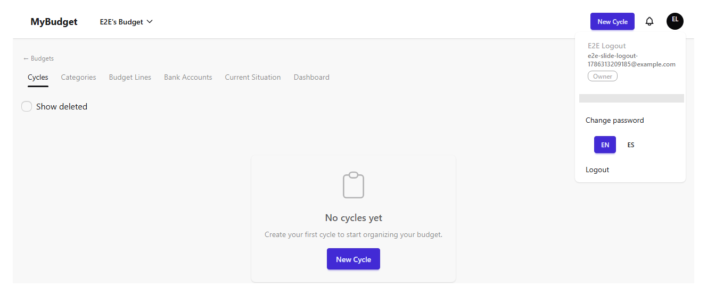
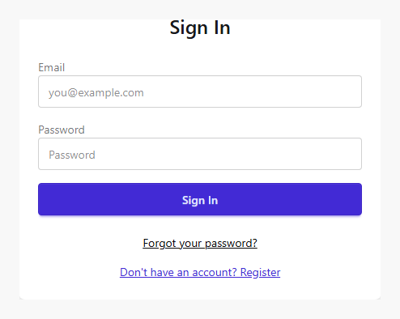

# auth

| # | Image | Title | Description |
|---|-------|-------|-------------|
| 1 |  | Register — empty form | The registration form before any input. |
| 2 |  | Register — filled form | The registration form filled with valid data, ready to submit. |
| 3 |  | Register — success | After submit: auto-login and redirect to the home/cycles view. |
| 4 |  | Register — duplicate email error | Submitting an already-registered email stays on the form and shows a 409 error. |
| 5 |  | Login — empty form | The login form before any input. |
| 6 |  | Login — success | Valid credentials redirect to the home/cycles view. |
| 7 |  | Login — invalid credentials error | Wrong password stays on /login and shows an error alert. |
| 8 |  | Logout — user menu | The account dropdown with the logout action, opened from the avatar. |
| 9 |  | Logout — success | Session cleared, back on /login. |
