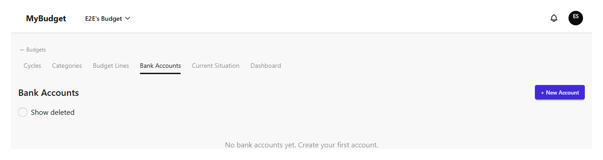
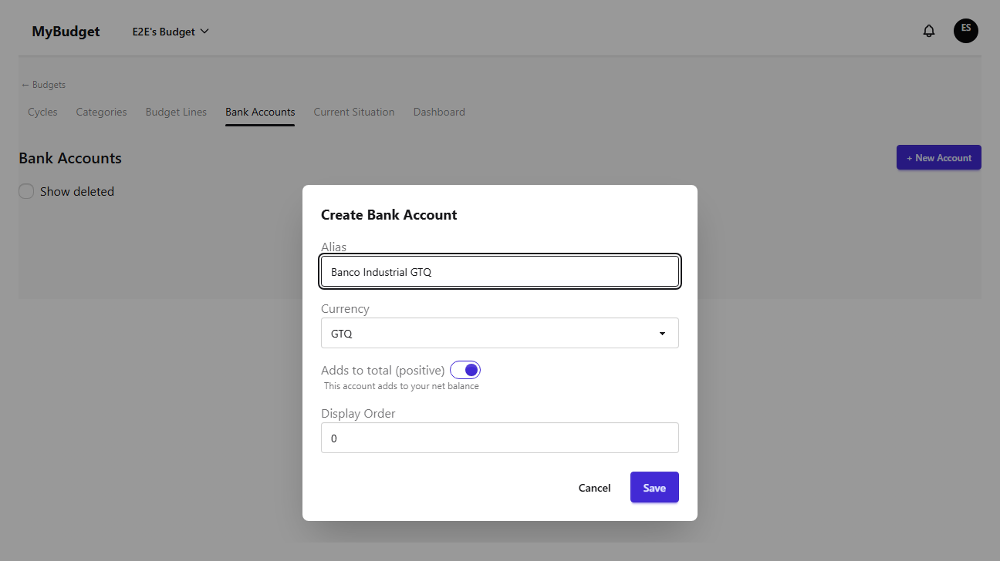
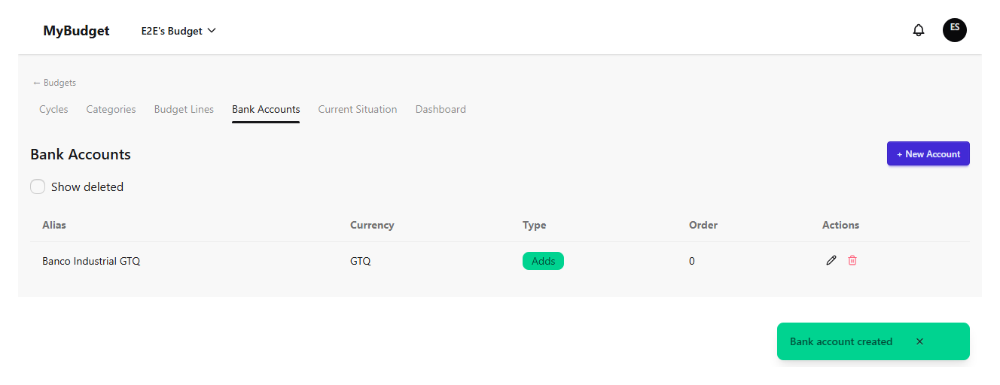
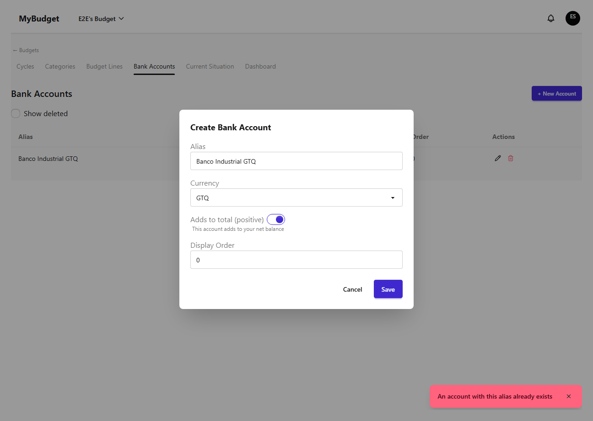
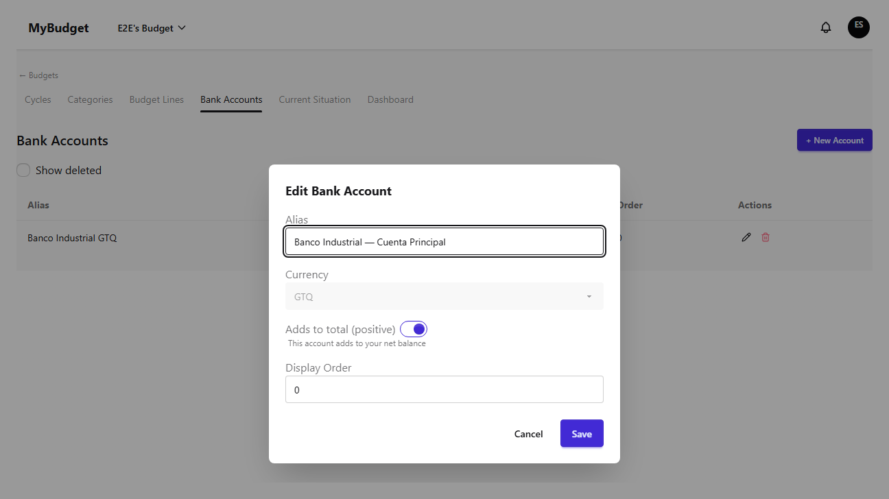
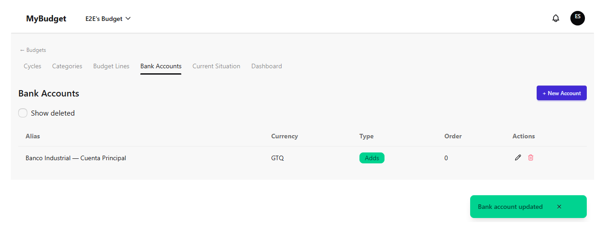
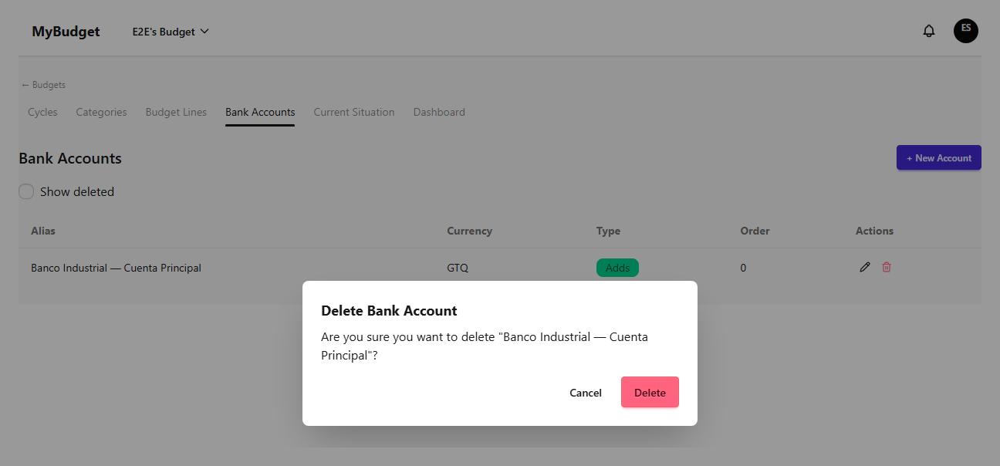
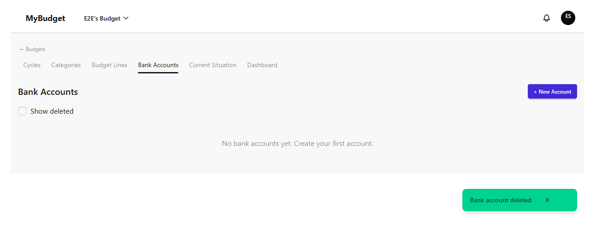
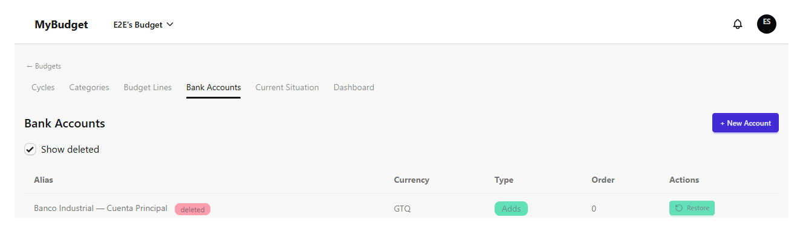
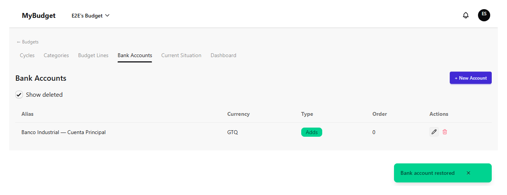

# bank-accounts

| # | Image | Title | Description |
|---|-------|-------|-------------|
| 1 |  | Bank Accounts — empty list | The bank accounts tab for a freshly created budget, before any account exists. |
| 2 |  | Create account — form filled | The new-account modal with alias and currency filled; positive-balance toggle defaults on. |
| 3 |  | Create account — success | Success toast and the new account listed. |
| 4 |  | Create account — duplicate alias error | Reusing an existing alias in the same budget is rejected with ALIAS_DUPLICATE. |
| 5 |  | Edit account — form | Edit modal with the alias changed (currency is locked once created). |
| 6 |  | Edit account — success | Success toast and the updated alias reflected in the list. |
| 7 |  | Delete account — confirm dialog | The destructive-action confirmation, naming the account by alias. |
| 8 |  | Delete account — success | Success toast; the deleted account drops out of the default (active-only) list. |
| 9 |  | Show deleted — toggle on | Toggling "Show deleted" reveals the soft-deleted account (dimmed, "deleted" badge) with a Restore action. |
| 10 |  | Restore account — success | The account is active again after restore. |
