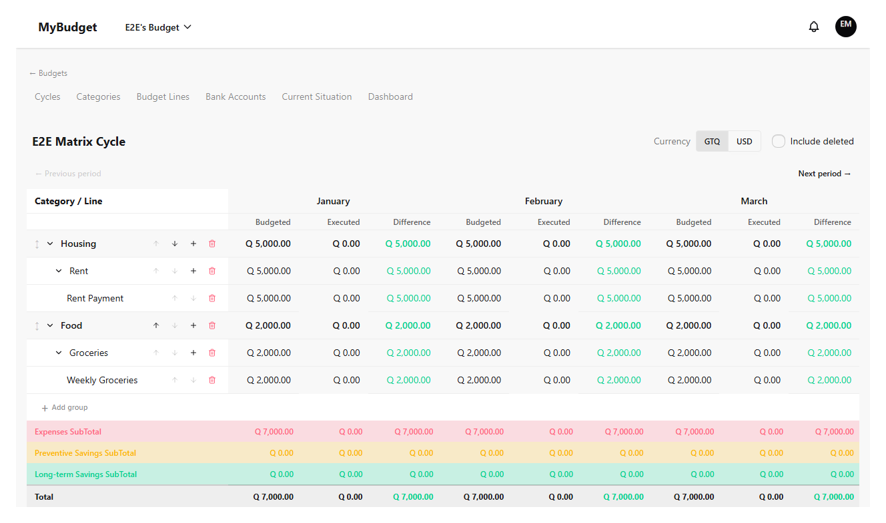
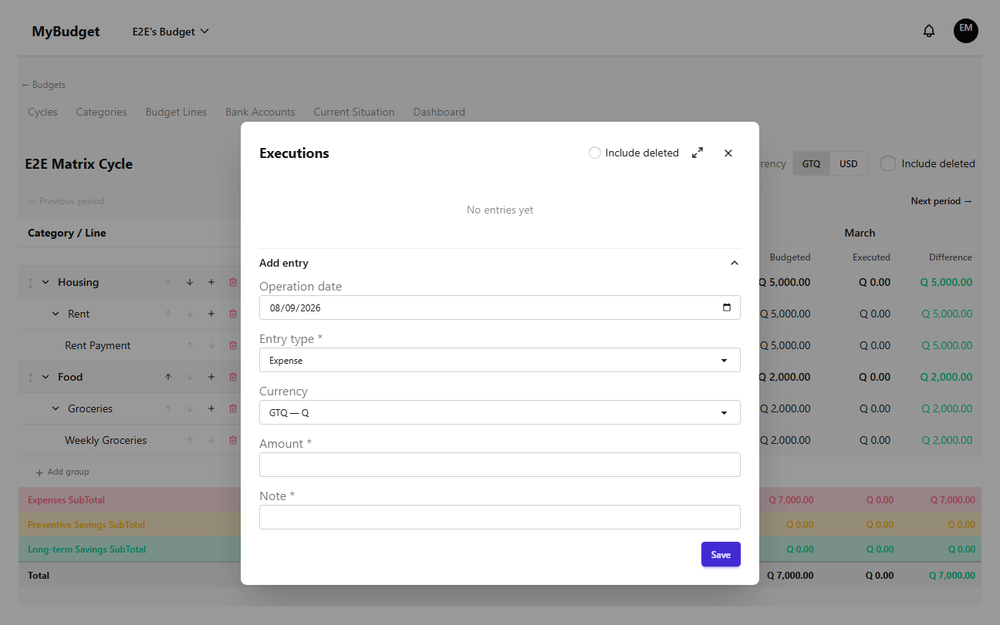
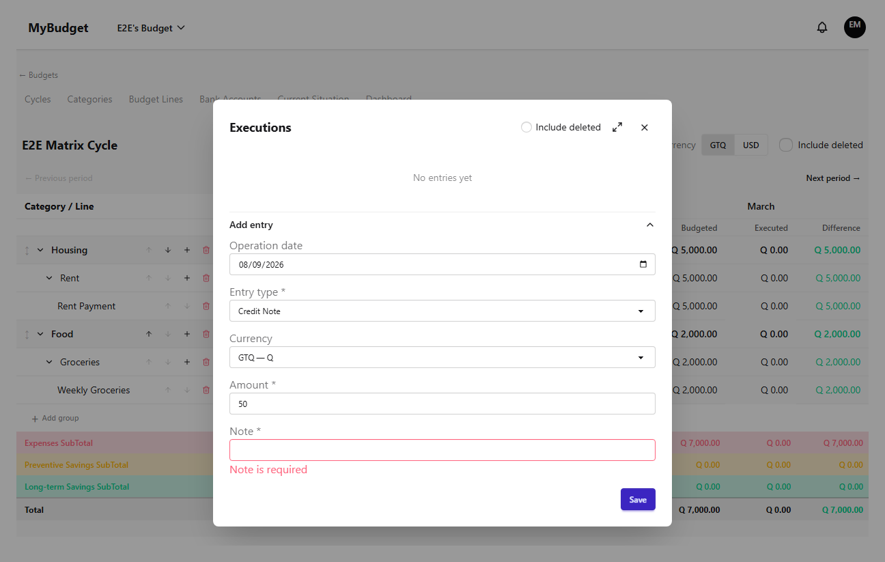
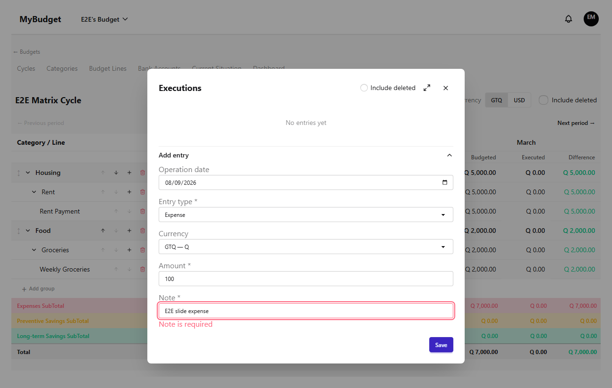
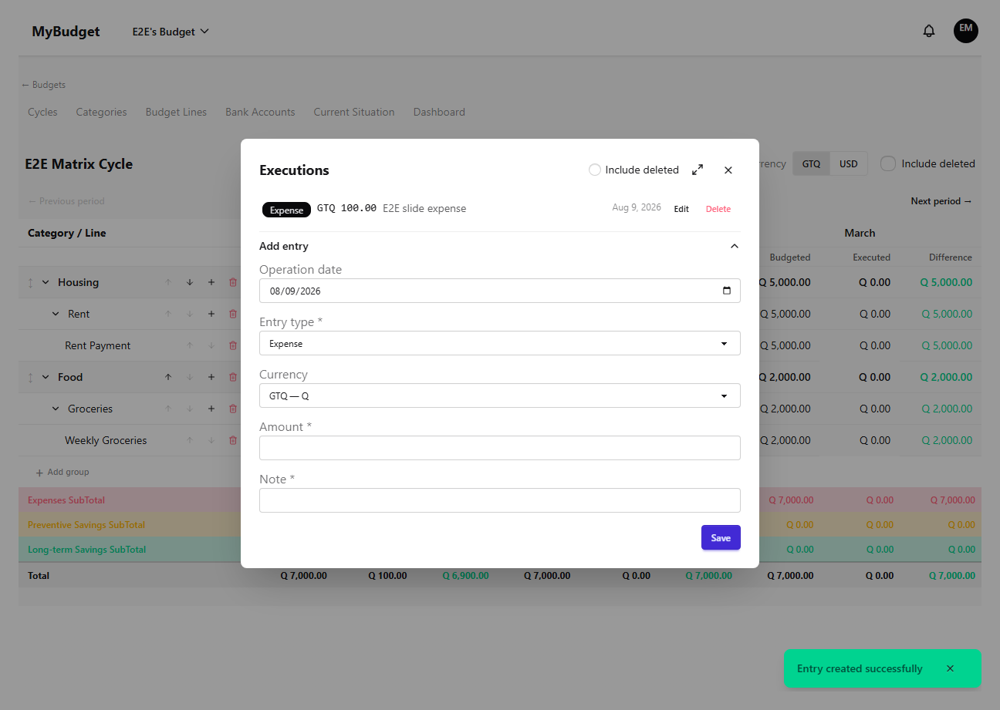
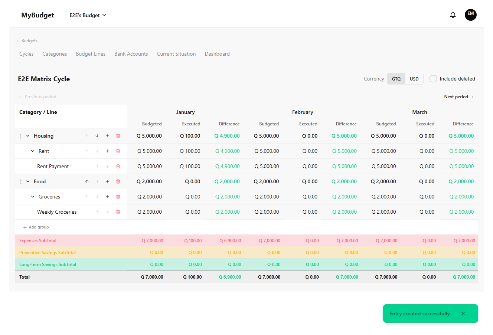
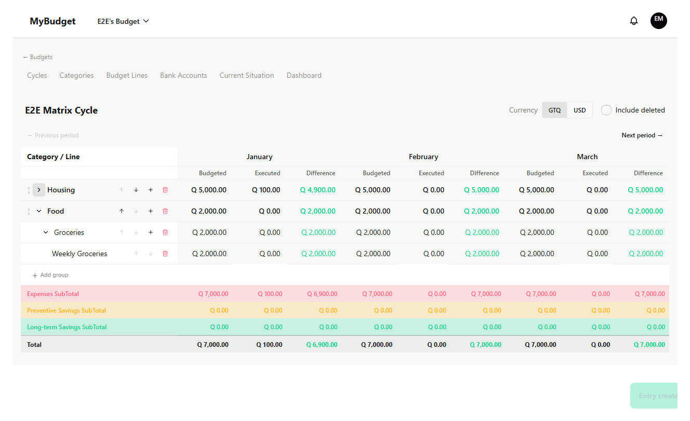
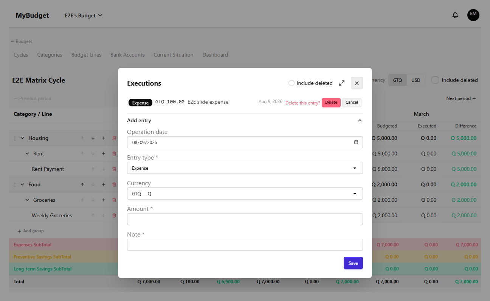
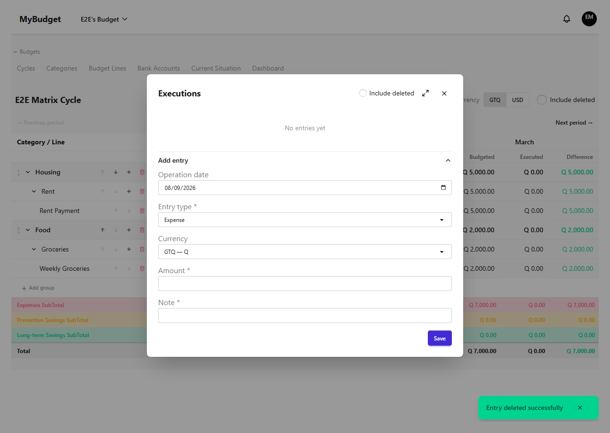

# budget-execution

| # | Image | Title | Description |
|---|-------|-------|-------------|
| 1 |  | Budget Execution — matrix view | Budget lines by category group, periods as columns, before any execution is recorded. |
| 2 |  | Open execution modal | Double-clicking an Ejecutado cell opens the execution list/create modal for that line and period. |
| 3 |  | Create execution — note required error | Submitting without a note is rejected client-side — note is mandatory for every entry type. |
| 4 |  | Create execution — form filled | Expense entry with amount and note, ready to submit. |
| 5 |  | Create execution — success | The new record appears in the modal list. |
| 6 |  | Matrix — updated Ejecutado total | The Ejecutado cell reflects the new execution total after closing the modal. |
| 7 |  | Currency toggle — USD | Amounts convert to USD at the cycle's exchange rate. |
| 8 |  | Currency toggle — back to GTQ | Toggling back restores the original GTQ amounts. |
| 9 |  | Collapse group | Collapsing a category group hides its category rows for a denser overview. |
| 10 |  | Delete execution — confirm | A first click arms a two-step confirm before the destructive delete. |
| 11 |  | Delete execution — success | The record list is empty again after delete. |
