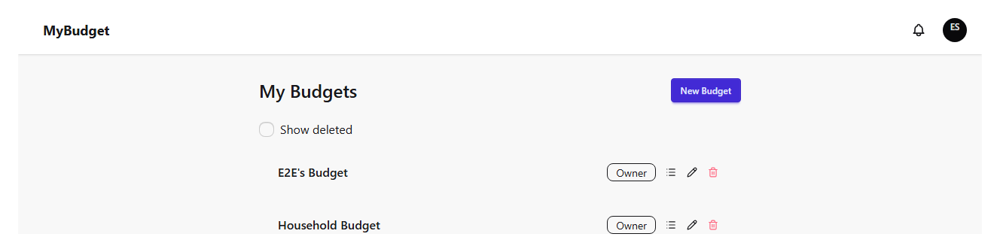
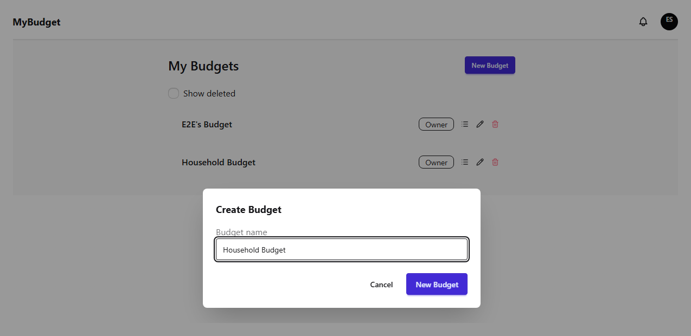
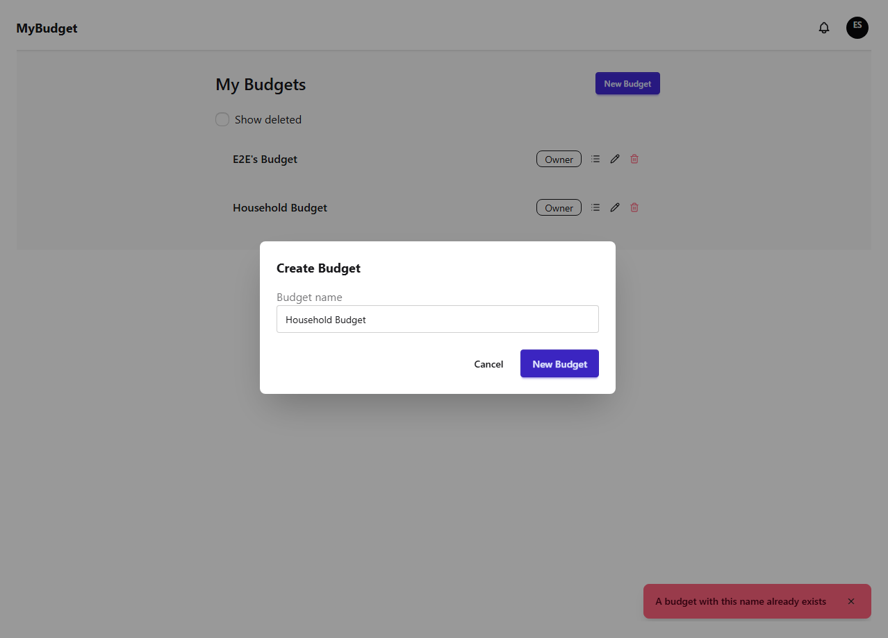
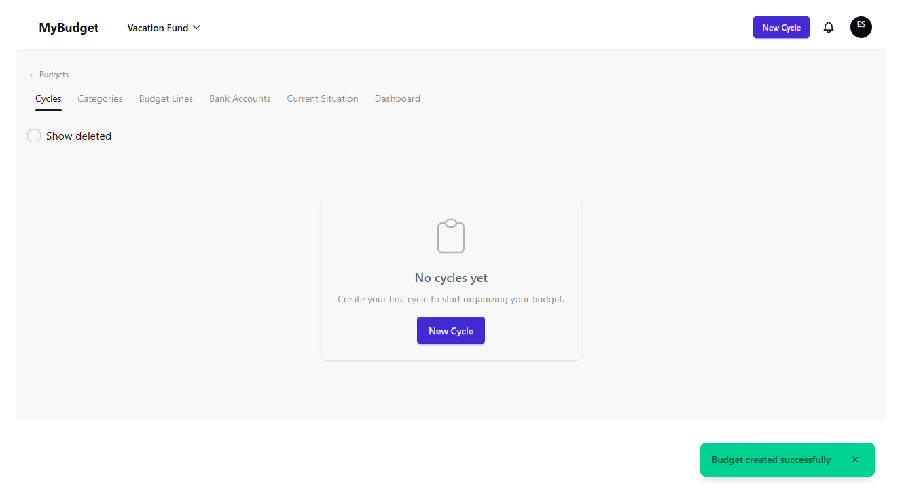
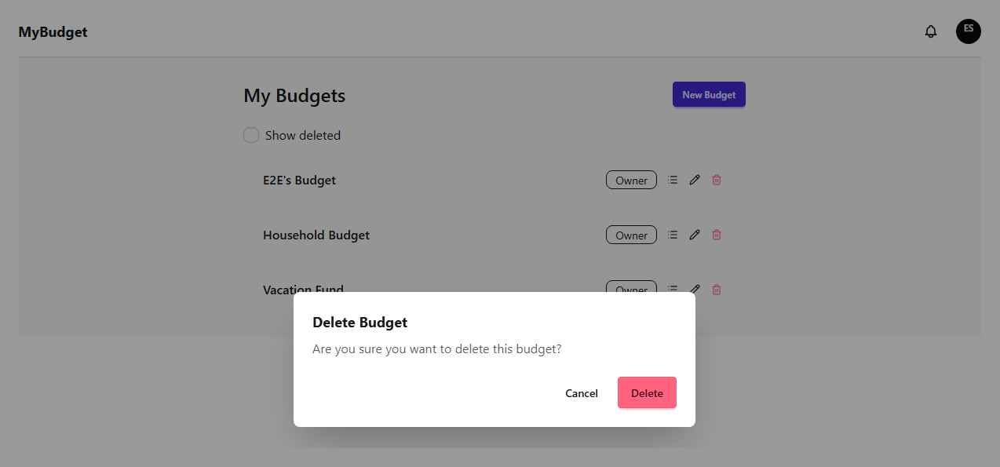
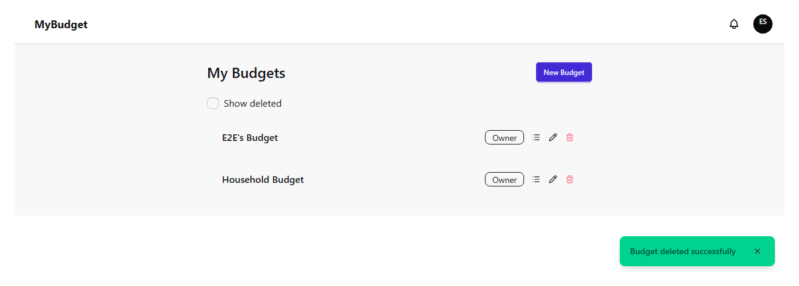
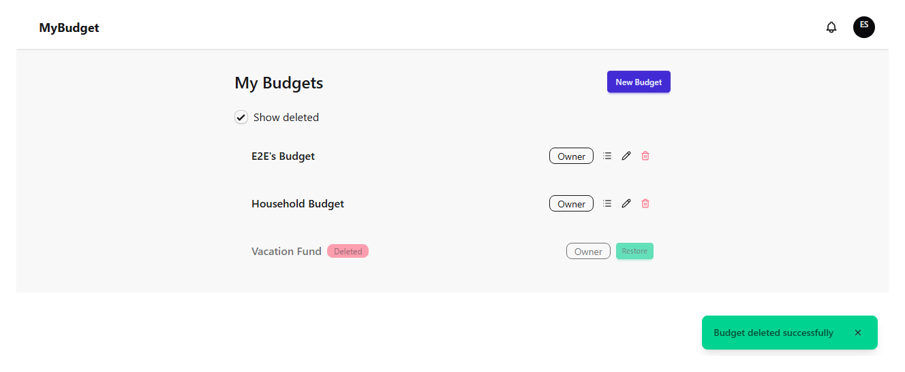
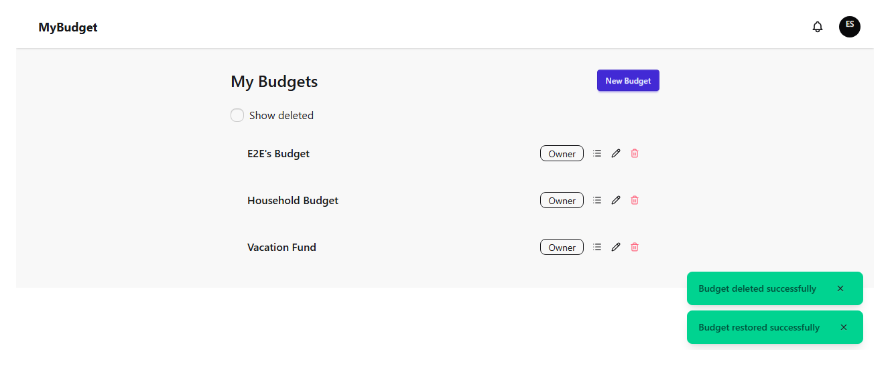
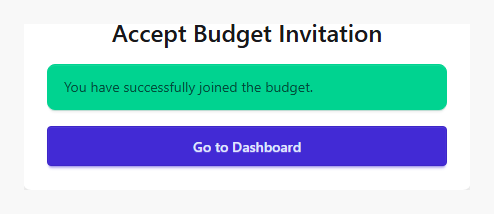
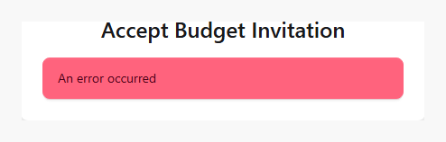

# budget-management

| # | Image | Title | Description |
|---|-------|-------|-------------|
| 1 |  | Budget selection — list | The budget switcher, listing every budget the user belongs to. |
| 2 |  | Create budget — form filled | The new-budget modal filled with a name. |
| 3 |  | Create budget — duplicate name error | Reusing an existing budget name is rejected with BUDGET_NAME_DUPLICATE. |
| 4 |  | Create budget — success | Creating a budget navigates straight into it — an empty cycles list, name shown in the navbar. |
| 5 |  | Delete budget — confirm dialog | The destructive-action confirmation before a soft-delete. |
| 6 |  | Delete budget — success | The deleted budget drops out of the active list. |
| 7 |  | Show deleted — toggle on | Toggling "Show deleted" reveals the soft-deleted budget with a Restore action. |
| 8 |  | Restore budget — success | The budget is active again after restore. |
| 9 |  | Accept invitation — success | A valid invite token grants membership and shows a success message. |
| 10 |  | Accept invitation — unknown token error | An invalid or expired token shows an error instead of a crash. |
