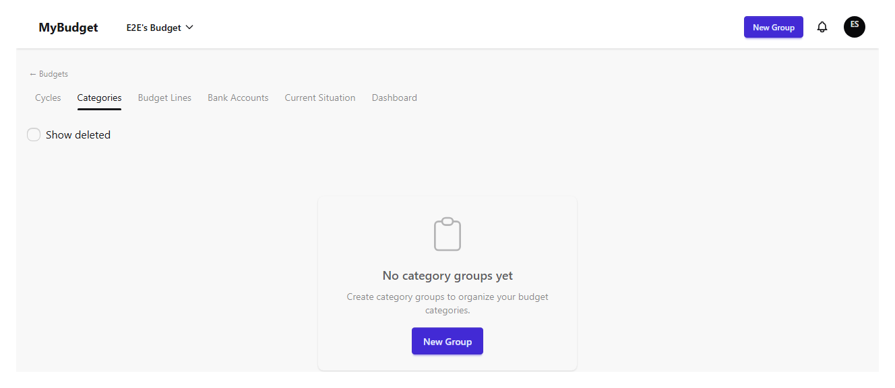
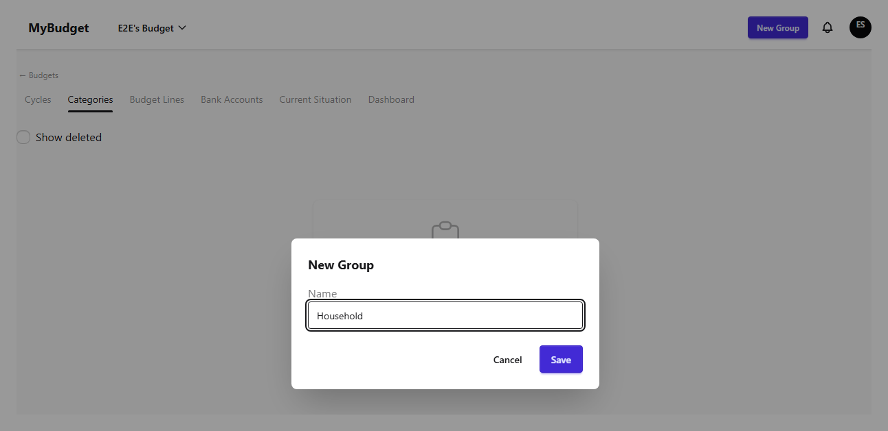
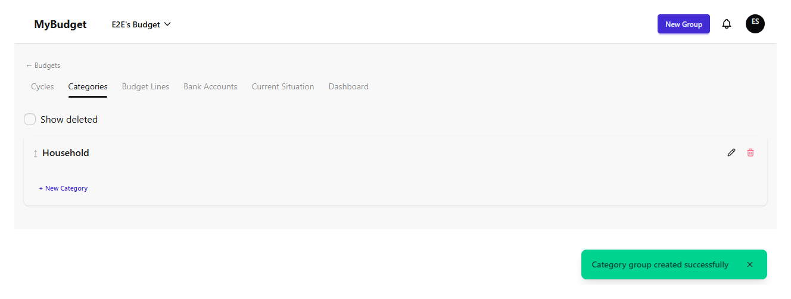
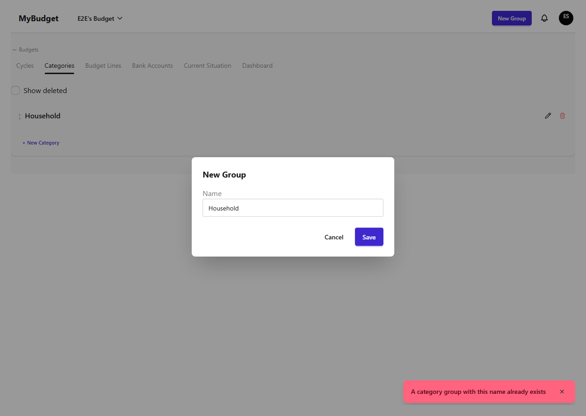
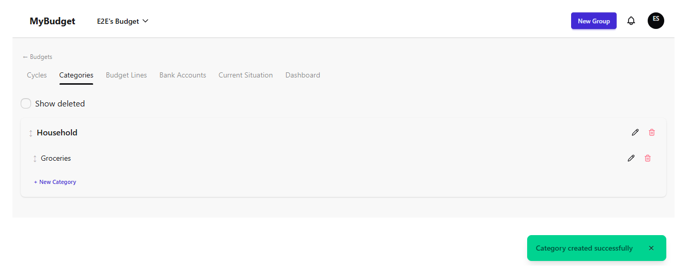
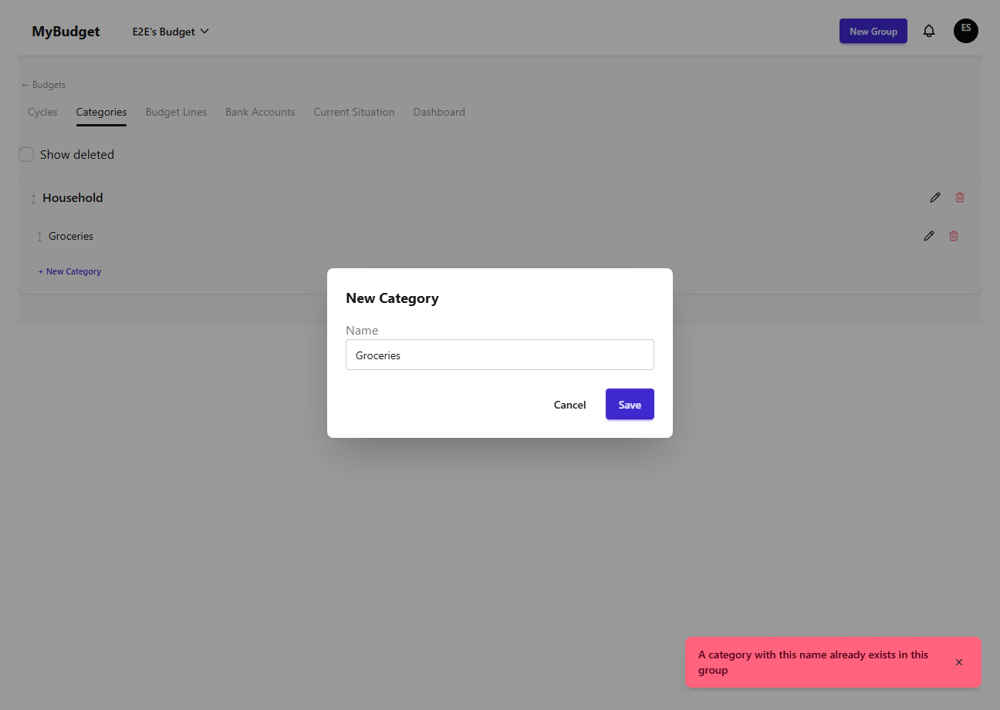
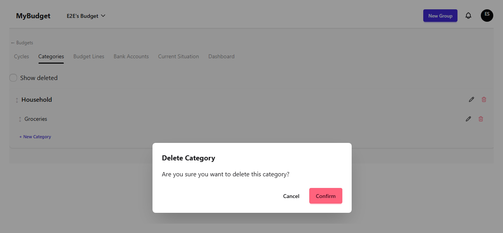
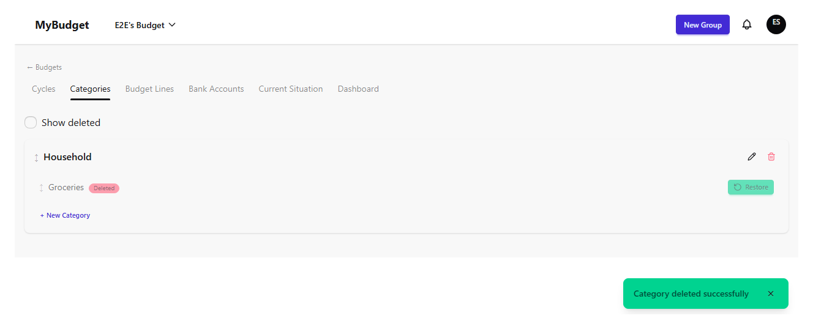
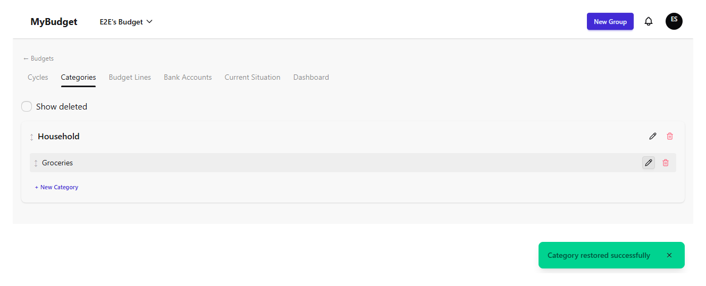

# budget-structure-categories

| # | Image | Title | Description |
|---|-------|-------|-------------|
| 1 |  | Categories — empty list | The categories tab for a freshly created budget, before any group exists. |
| 2 |  | Create group — form filled | The new-group modal filled with a name. |
| 3 |  | Create group — success | Success toast and the new group listed. |
| 4 |  | Create group — duplicate name error | Reusing an existing group name in the same budget is rejected with CATEGORY_GROUP_NAME_DUPLICATE. |
| 5 |  | Create category — form filled | The new-category modal, filled, nested under the Household group. |
| 6 |  | Create category — success | Success toast and the new category listed under its group. |
| 7 |  | Create category — duplicate name error | Reusing an existing category name in the same group is rejected with CATEGORY_NAME_DUPLICATE. |
| 8 |  | Delete category — confirm dialog | The destructive-action confirmation before a soft-delete. |
| 9 |  | Delete category — success | Soft-deleted category stays listed with a "Deleted" badge and a Restore action. |
| 10 |  | Restore category — success | The category is active again after restore. |
