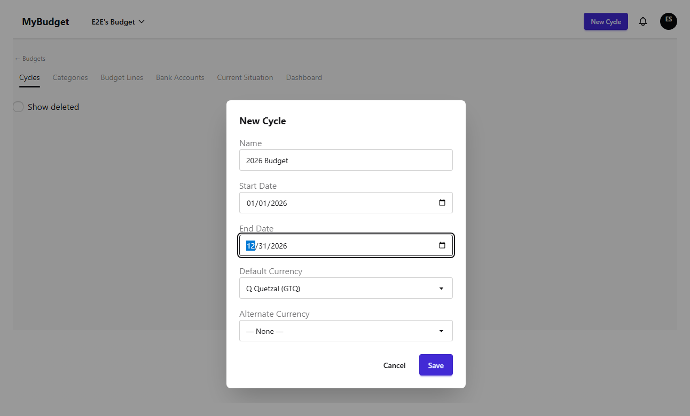
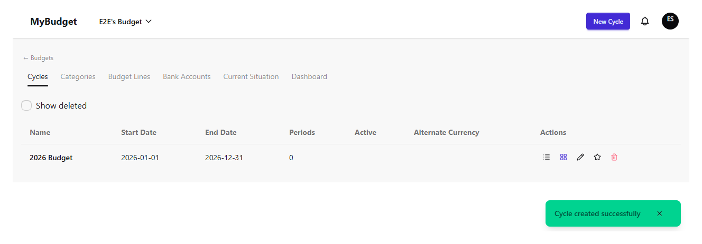
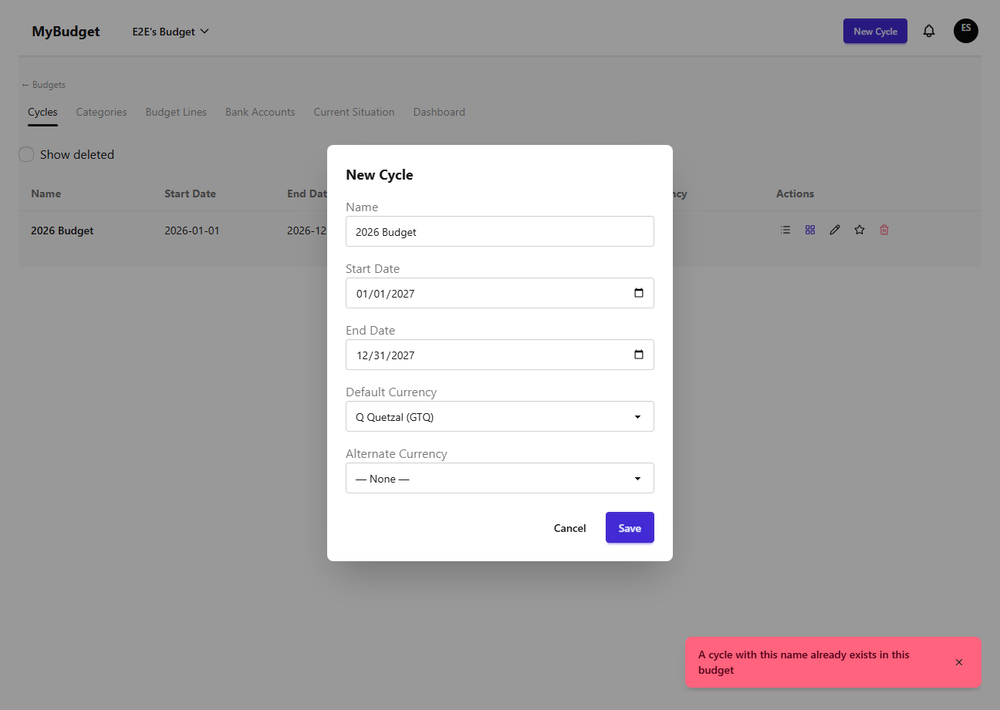
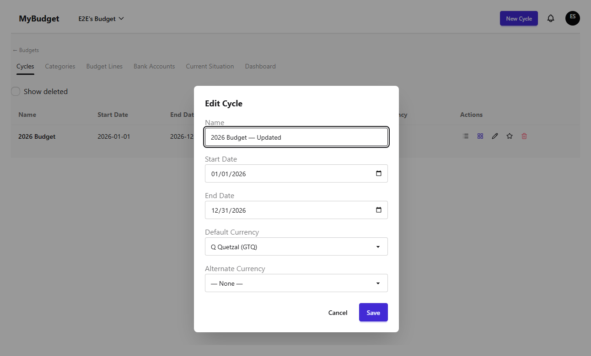
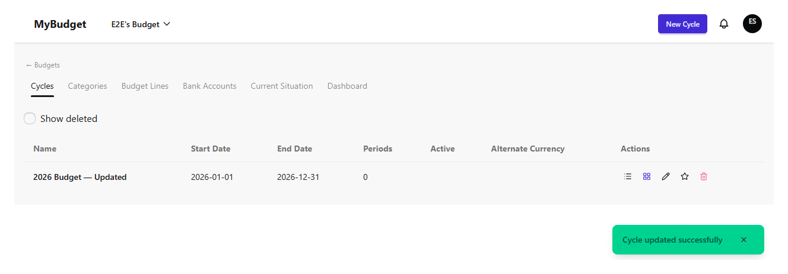
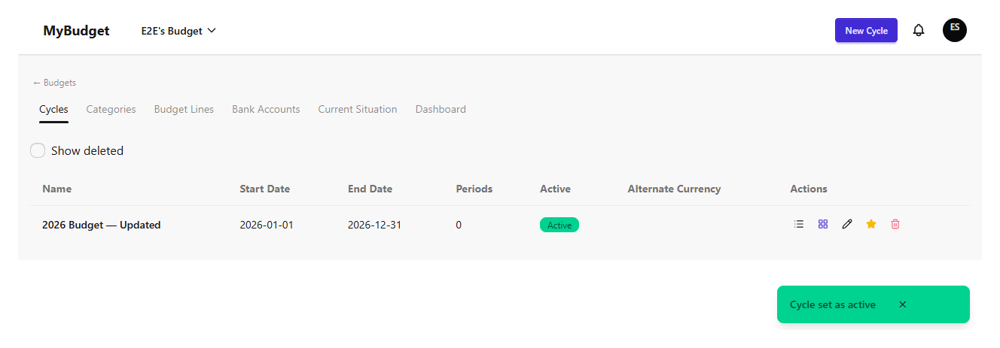
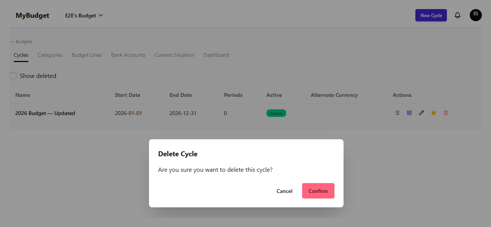
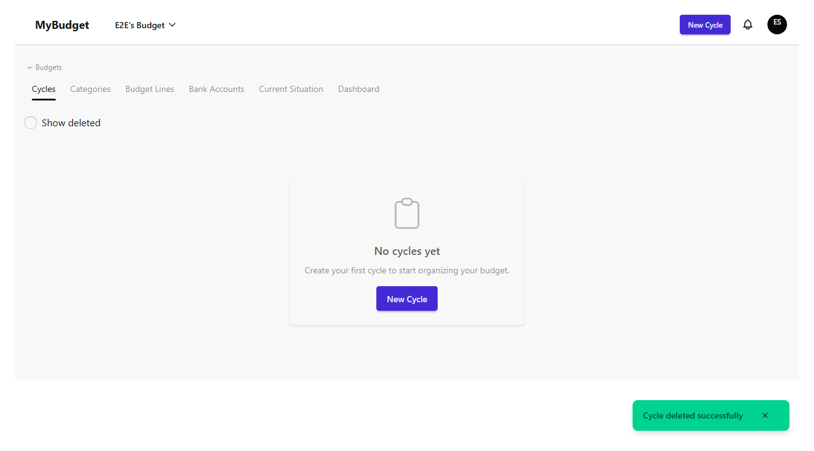

# budget-structure-cycles

| # | Image | Title | Description |
|---|-------|-------|-------------|
| 1 |  | Cycles — empty list | The cycles list for a freshly created budget, before any cycle exists. |
| 2 |  | Create cycle — form filled | The new-cycle modal filled with a name and date range. |
| 3 |  | Create cycle — success | Success toast and the new cycle listed. |
| 4 |  | Create cycle — duplicate name error | Reusing an existing cycle name in the same budget is rejected with CYCLE_NAME_DUPLICATE. |
| 5 |  | Edit cycle — form | Inline edit form with the name changed. |
| 6 |  | Edit cycle — success | Success toast and the updated name reflected in the list. |
| 7 |  | Set active cycle — success | The cycle marked Active, driving which cycle budget-execution defaults to. |
| 8 |  | Delete cycle — confirm dialog | The destructive-action confirmation before a soft-delete. |
| 9 |  | Delete cycle — success | Cycle soft-deleted; success toast shown. |
