# budget-structure-periods-lines

| # | Image | Title | Description |
|---|-------|-------|-------------|
| 1 | 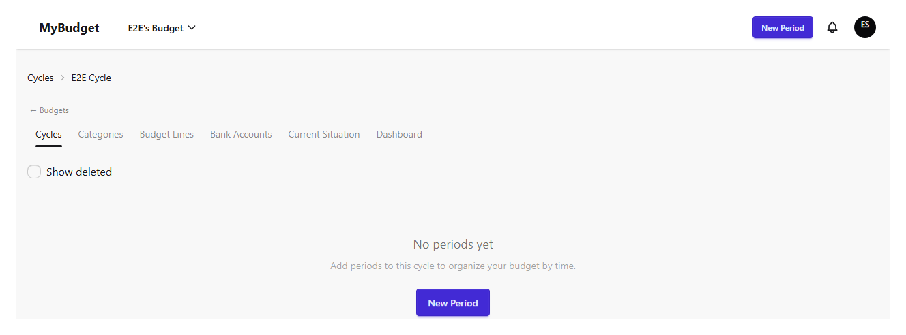 | Periods — empty list | A cycle detail view before any period exists. |
| 2 | 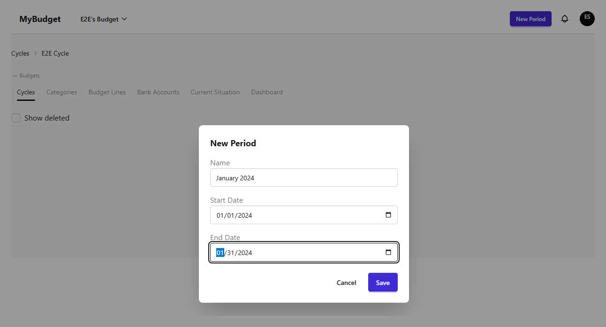 | Create period — form filled | The new-period modal filled with a name and date range. |
| 3 | 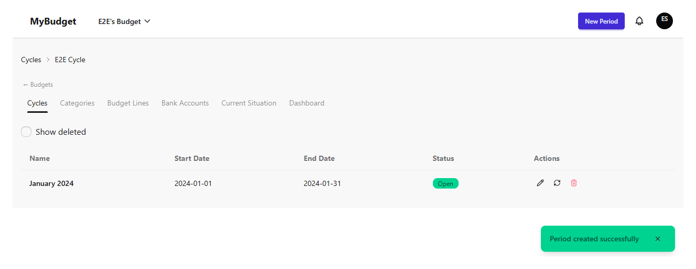 | Create period — success | Success toast and the new period listed. |
| 4 | 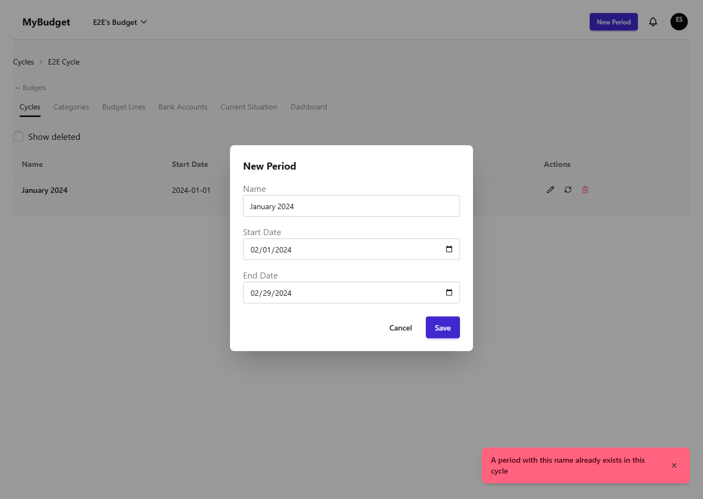 | Create period — duplicate name error | Reusing an existing period name in the same cycle is rejected with PERIOD_NAME_DUPLICATE. |
| 5 | 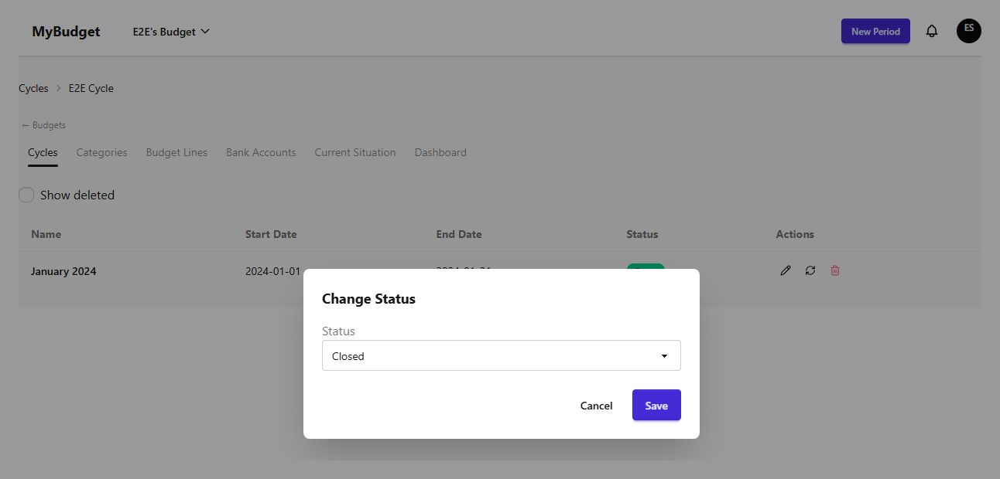 | Change period status — form | The status dropdown set to Closed, ready to save. |
| 6 | 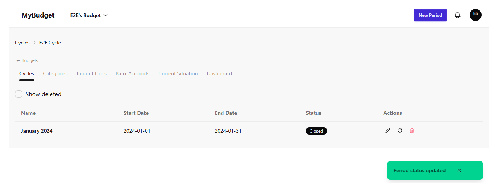 | Change period status — success | Success toast and the Closed badge on the period. |
| 7 | 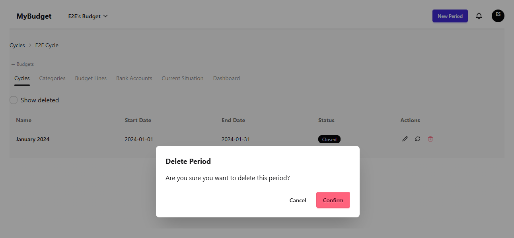 | Delete period — confirm dialog | The destructive-action confirmation before a soft-delete. |
| 8 | 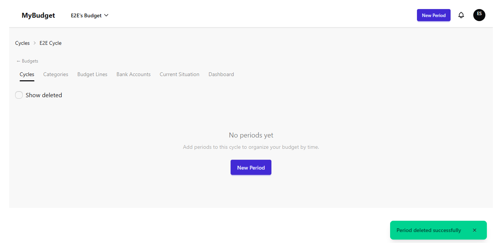 | Delete period — success | Period soft-deleted; success toast shown. |
| 9 | 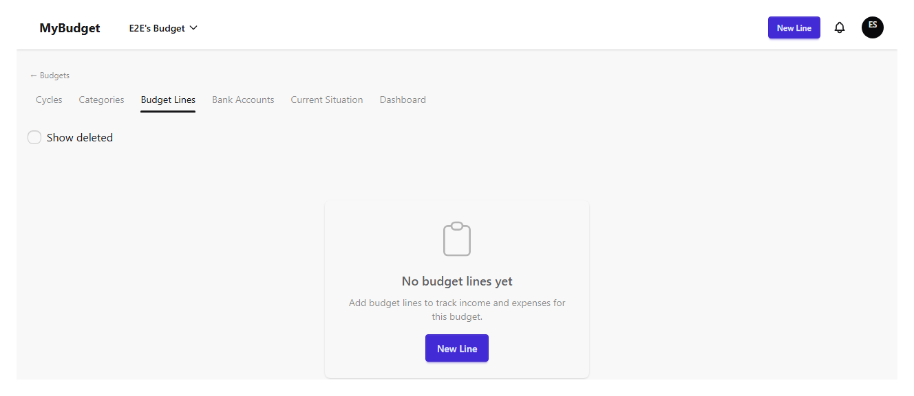 | Budget Lines — empty list | The budget lines view before any line exists. |
| 10 | 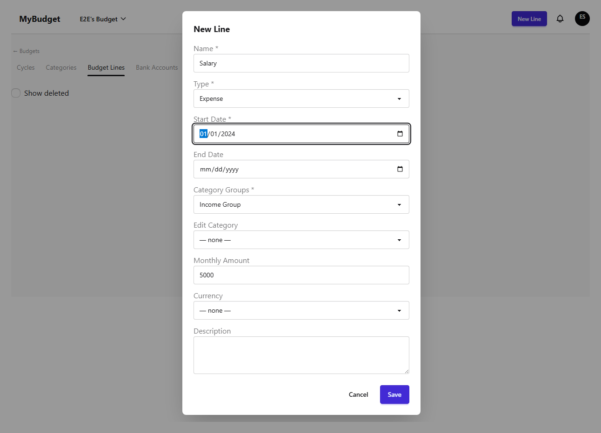 | Create budget line — form filled | The new-line modal filled with name, type, group, amount, and start date. |
| 11 | 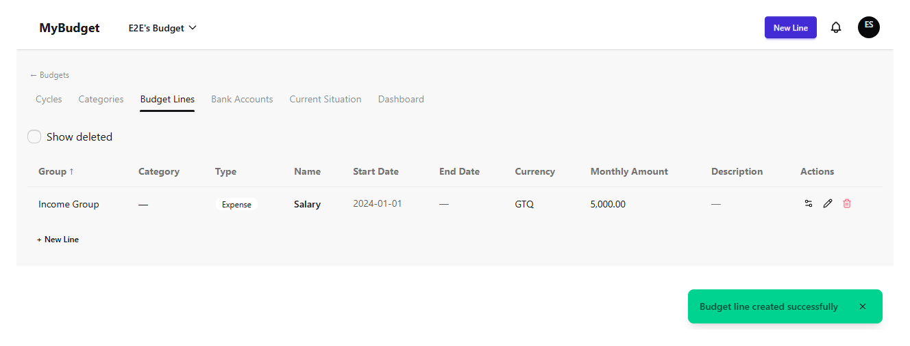 | Create budget line — success | Success toast and the new line listed. |
| 12 | 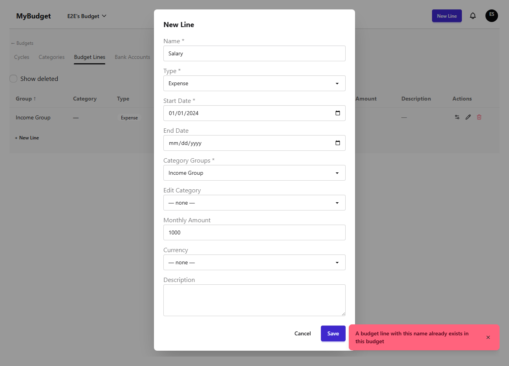 | Create budget line — duplicate name error | Reusing an existing line name in the same budget is rejected with BUDGET_LINE_NAME_DUPLICATE. |
| 13 | 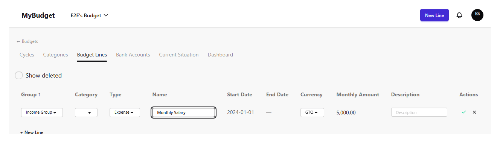 | Edit budget line — inline | Double-click opens inline edit directly in the row (no modal). |
| 14 | 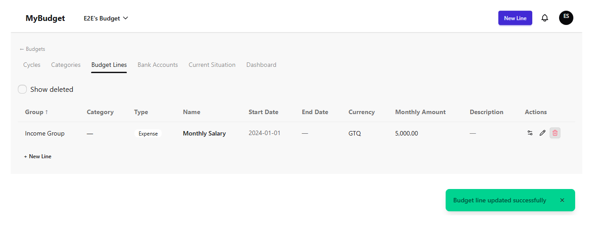 | Edit budget line — success | Success toast and the updated name reflected in the row. |
| 15 | 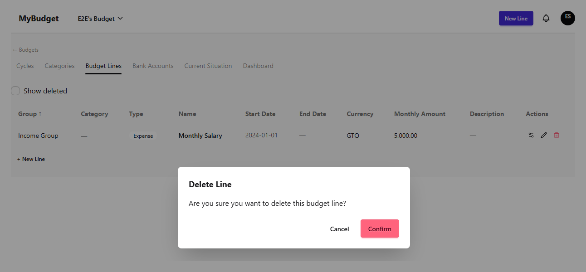 | Delete budget line — confirm dialog | The destructive-action confirmation before a soft-delete. |
| 16 | 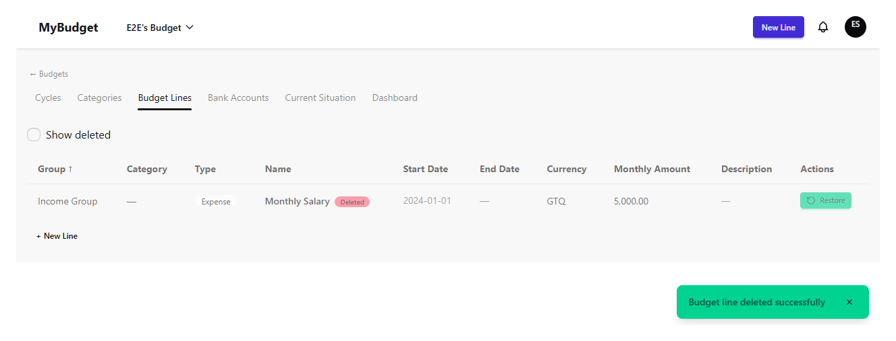 | Delete budget line — success | Soft-deleted line stays listed with a "Deleted" badge. |
