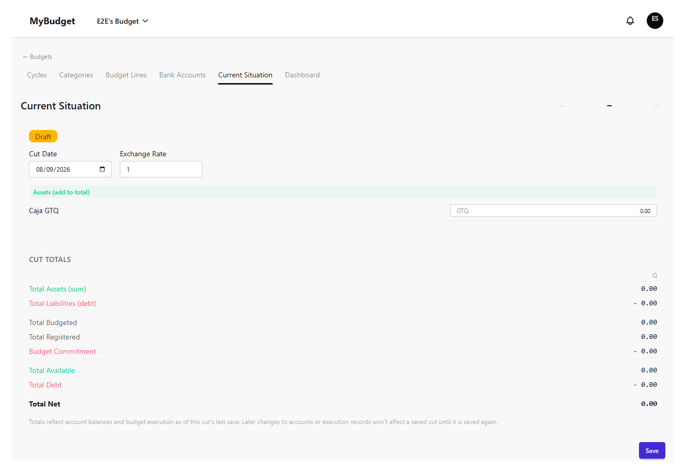
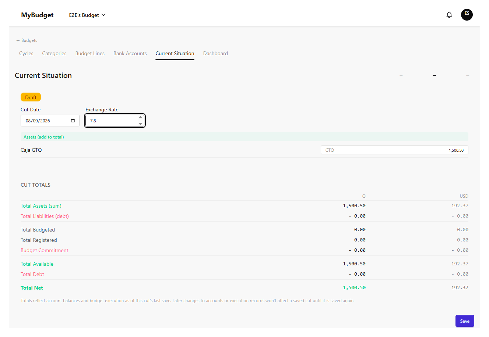
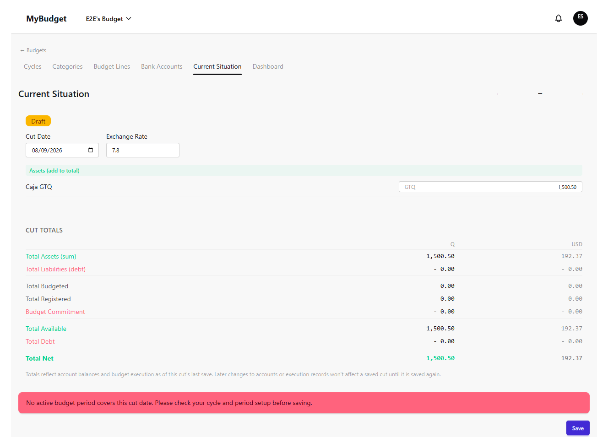
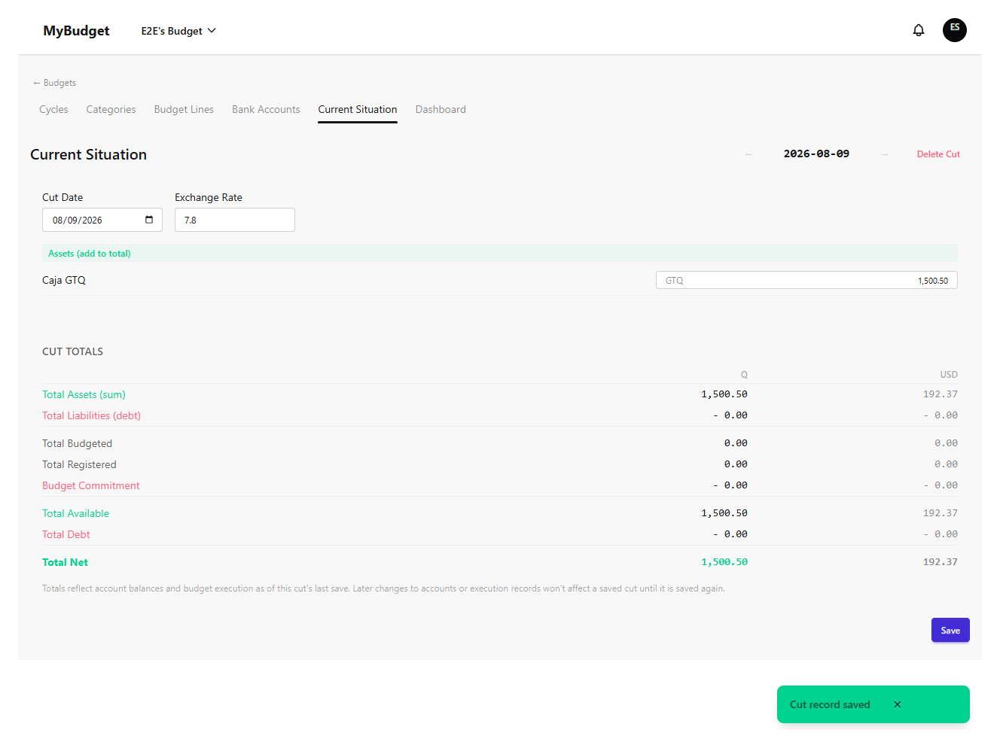
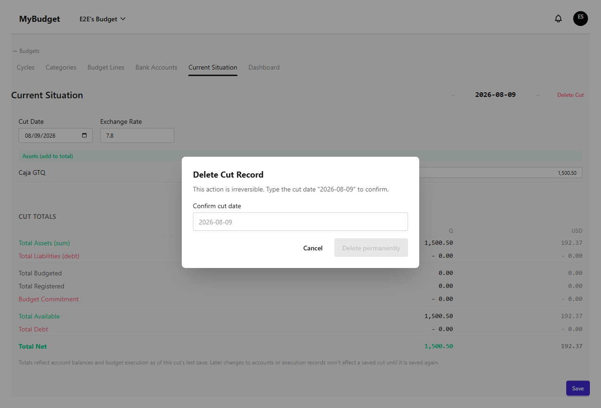
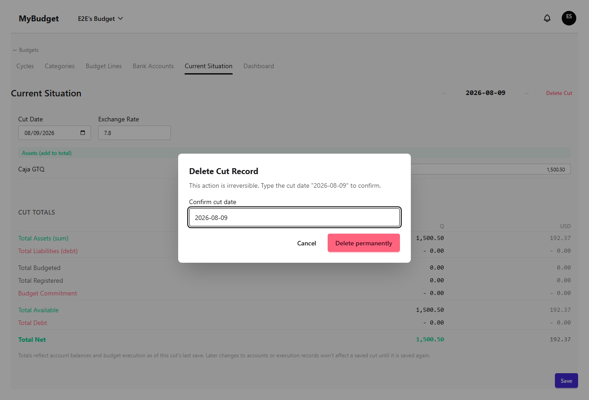
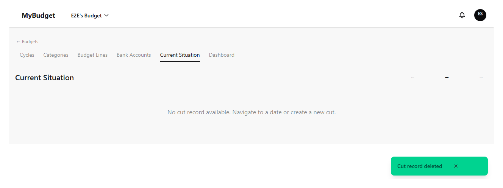

# current-situation

| # | Image | Title | Description |
|---|-------|-------|-------------|
| 1 |  | Current Situation — draft form | A new cut, pre-populated with active bank accounts at balance 0 (Draft badge shown). |
| 2 |  | Current Situation — form filled | Balance and exchange rate entered, ready to save. |
| 3 |  | Save — no active period error | Saving fails with a 422 when no budget period covers the cut date yet. |
| 4 |  | Save — success | Success toast; the totals panel reflects the saved balances and exchange rate. |
| 5 |  | Delete cut — confirm dialog | Deletion requires typing the exact cut date to confirm — the button starts disabled. |
| 6 |  | Delete cut — date typed | Once the typed date matches, the delete button becomes enabled. |
| 7 |  | Delete cut — success | Cut record deleted; success toast shown. |
