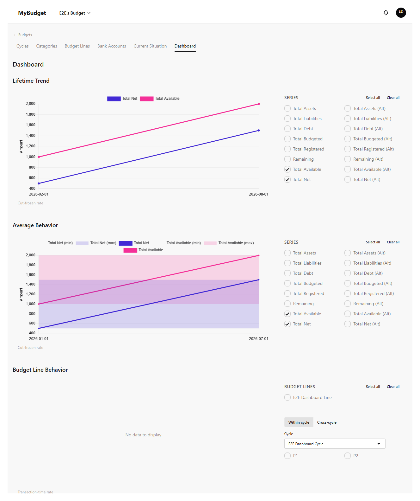
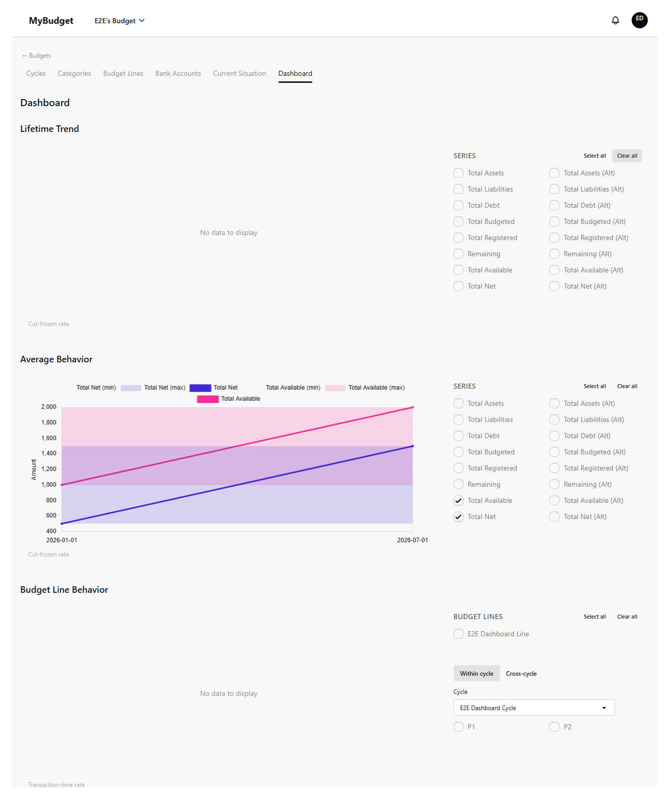
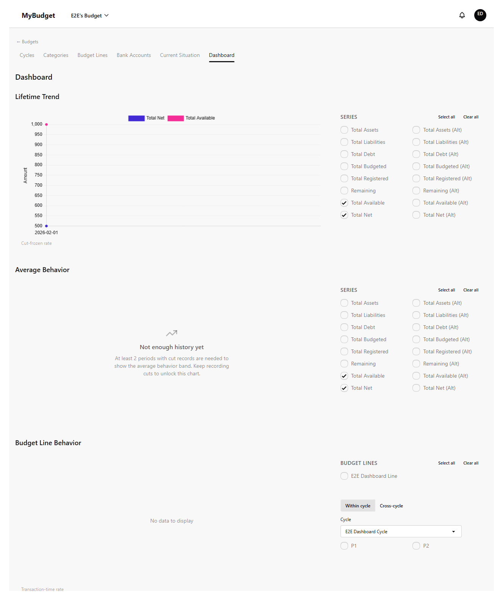
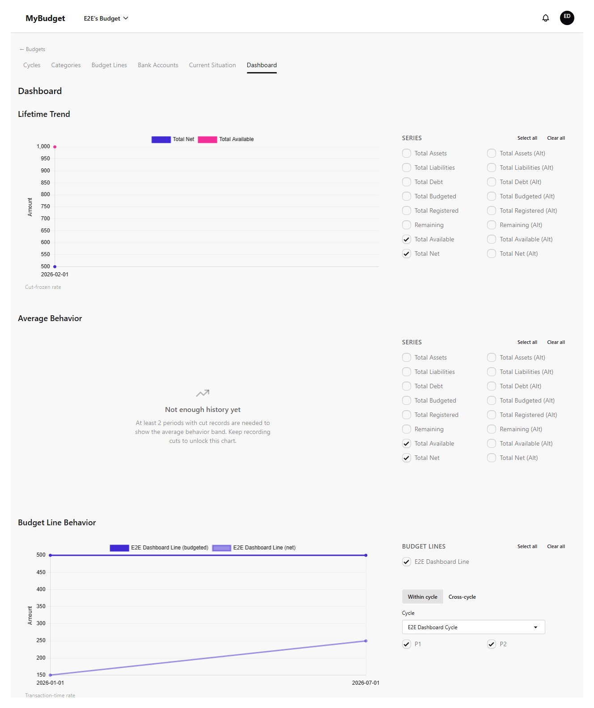
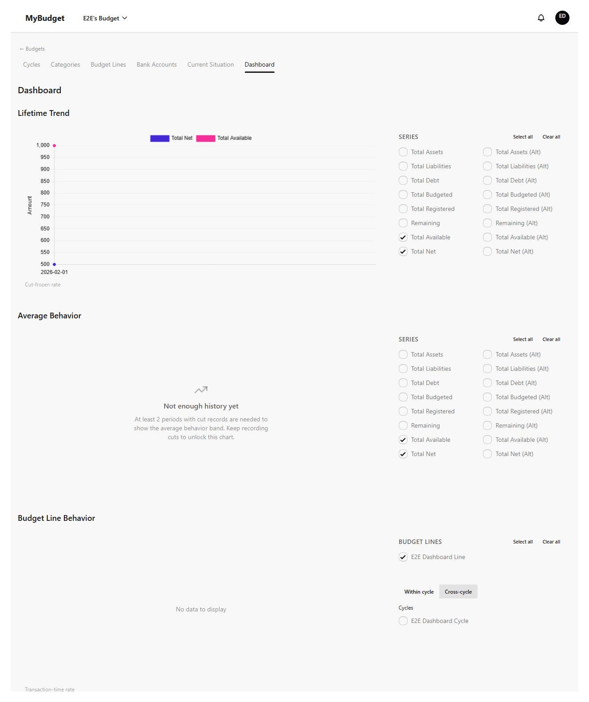
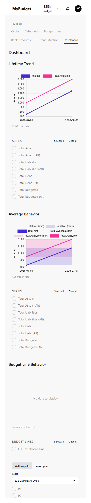

# dashboard

| # | Image | Title | Description |
|---|-------|-------|-------------|
| 1 |  | Dashboard — lifetime trend | The default landing view: net-worth trend across all cut records. |
| 2 |  | Dashboard — series picker empty state | Clearing the series picker drives the chart to its empty state, proving the picker controls it. |
| 3 |  | Dashboard — BudgetLine chart empty state | No line or period selected yet. |
| 4 |  | Dashboard — BudgetLine chart | A line and two periods selected: within-cycle period-vs-period comparison. |
| 5 |  | Dashboard — cross-cycle mode | Switching modes swaps the within-cycle period picker for a cycle picker. |
| 6 |  | Dashboard — insufficient history | Fewer than 2 cut records: an explicit empty state instead of a misleading computed band. |
| 7 |  | Dashboard — mobile viewport | The dashboard at a 375px-wide viewport, no horizontal overflow. |
