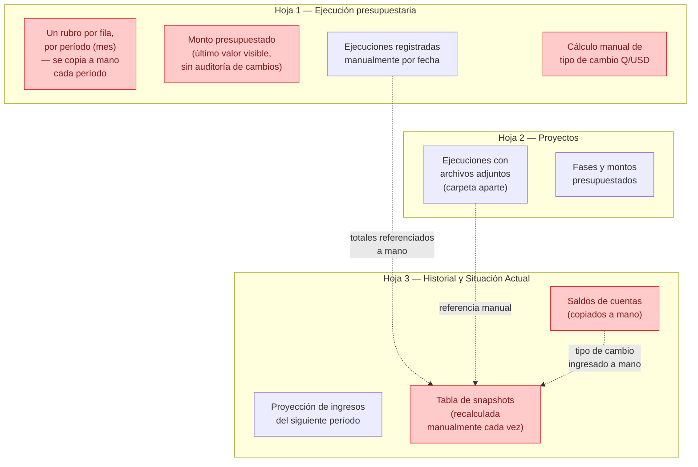
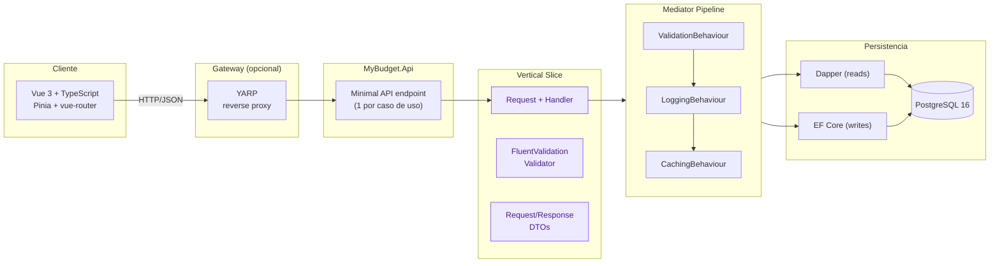
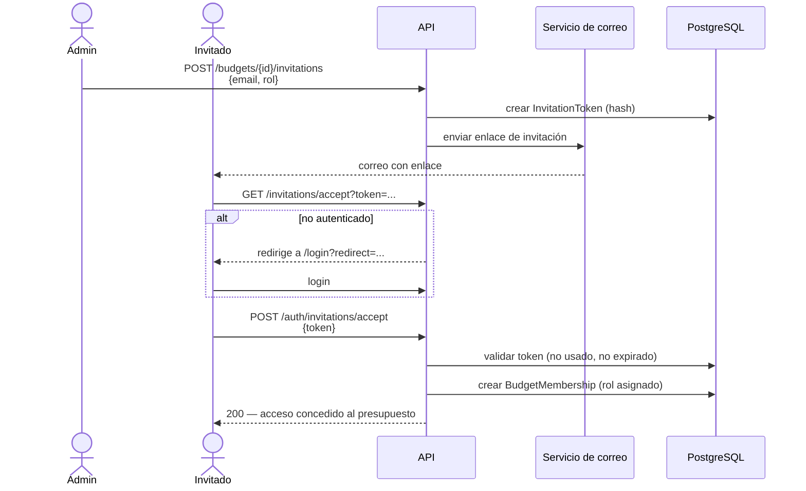
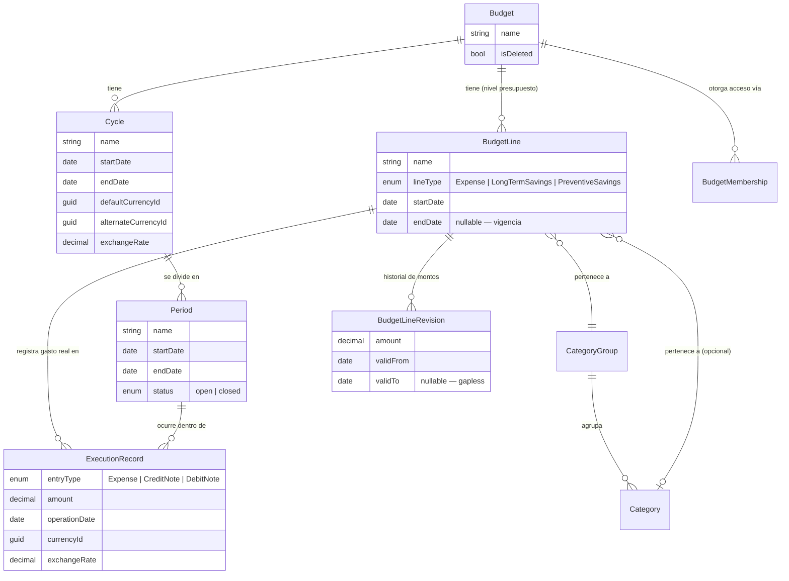
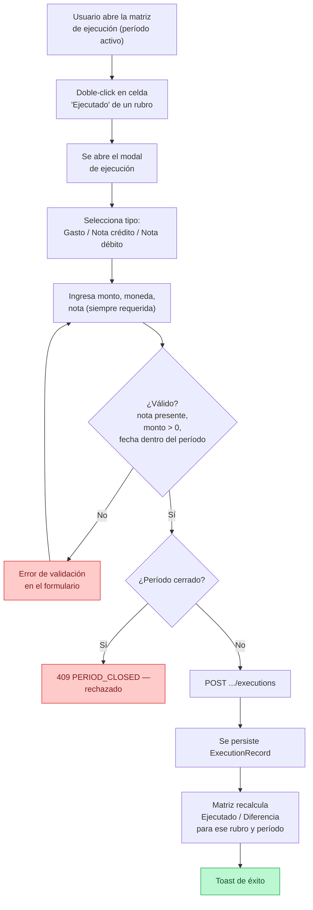

# MyBudget — Diagramas Mermaid

Fuente editable de los diagramas usados en `MyBudget.pptx`. Cada bloque se renderiza a PNG
(`pnpm run render-diagrams` desde `Project/frontend`, ver `outline.md`) y se inserta como imagen
en el PPTX — PowerPoint no renderiza mermaid nativamente.

Editar aquí, volver a renderizar, volver a insertar en el deck. No editar los PNG directamente.

---

## 1. El problema — hoja de cálculo actual

Usado en slide 2. Fuente: `AnalisisInicial/SituacionActual.txt`.

**Puntos de dolor** (rojo): re-creación manual por período, pérdida de historial de cambios, tipo
de cambio manual, reconciliación manual de snapshots — sin control de acceso ni auditoría.

---

## 2. Arquitectura — Vertical Slice Architecture

Usado en slide 5.

**Regla clave**: los slices nunca se referencian entre sí directamente — tipos compartidos solo
pasan a `SharedKernel` cuando los usan 3+ slices genuinamente.

---

## 3. Flujo de invitación de usuario

Usado en slide 8.

**Roles asignables**: Owner (100%), Admin, Operator (opera, no configura), Read-only (solo lectura).

---

## 4. Jerarquía del dominio

Usado en slide 11.

**Nota de diseño**: `BudgetLine` es a nivel de Budget (no de Period) desde el rediseño — vive con
un rango de fechas propio (`StartDate`/`EndDate`) y su monto planificado cambia a través de
`BudgetLineRevision`, un historial *append-only* sin huecos (invariante "gapless").

---

## 5. Flujo de registro de ejecución

Usado en slide 20.

